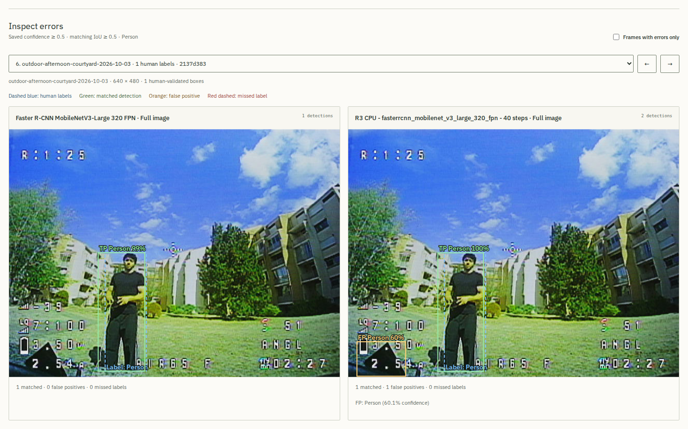
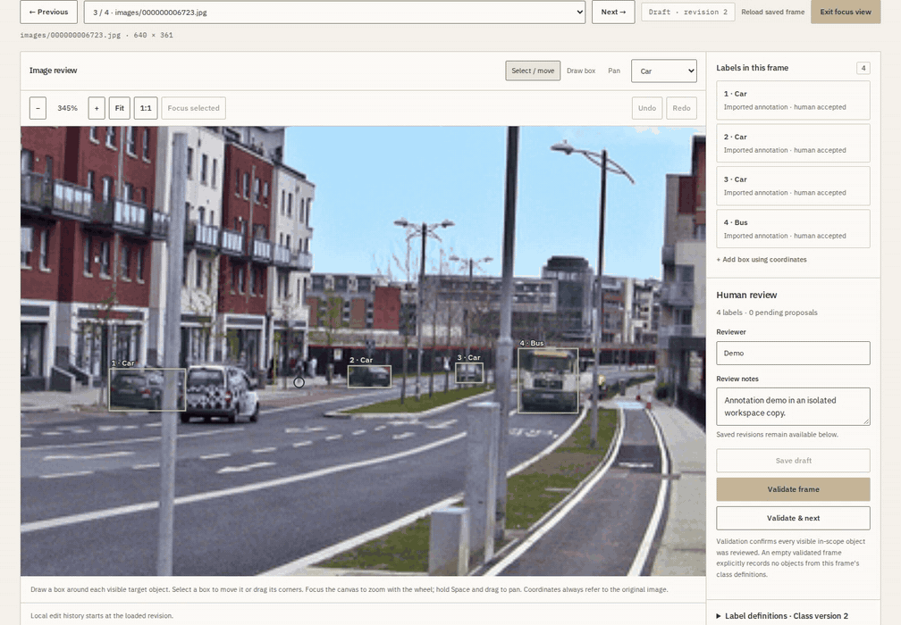
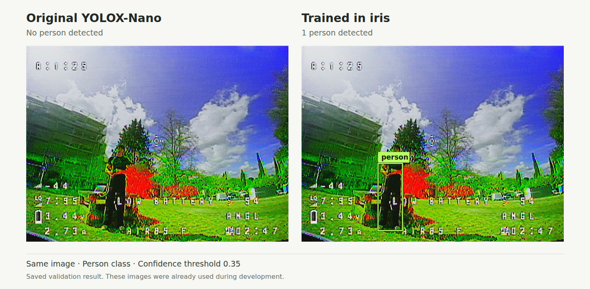

# iris

Aim to accelerate the learning loop from field data to mission-specific vision models.

[Portfolio](https://victormonnot.com/projects/iris/) · [Get started](#getting-started) · [Technical notes](#technical-notes)

## What I'm building

I'm building iris to make improving computer vision models faster and easier.
The idea is to bring your own images and videos, train models for what you need
them to detect, and compare the results before choosing one to use.

For example, you come back from a drone flight with new recordings. You use them
to train a new model, compare it with the old one and try it on the next flight.
You can keep different models for different missions and pick the one you need.
I want to make this easy enough to do after every flight, or whenever a project
brings in new data.



*Comparing two models on the same image. The extra box on the right is a false
detection.*

## What works today

iris runs on your computer and opens in your browser. It currently focuses on
object detection, which finds objects and draws boxes around them, and tracking,
which follows them across video frames.

- **Prepare the data.** Import images or videos and pick useful frames.
- **Review the labels.** Get suggested boxes, correct them and add anything missed.
- **Train a model.** Turn reviewed images into a dataset and adapt an existing
  detector to the objects you want it to recognize.
- **Compare the results.** Look at missed objects and false detections on the same
  images, including images kept out of training.
- **Work on tracking.** Compare trackers on recorded video and review the objects
  and identities they follow.
- **Use the result elsewhere.** Export trained models and save experiment reports.

The data, annotations, training settings and results stay linked, so I can go
back to an experiment and see how a model was made. I check the results before
choosing a new version; training alone doesn't tell me whether it's better.



*Correcting a box and adding a missing annotation before training.*
[Watch the video](docs/media/iris-annotation.mp4) · [Media sources and credits](docs/media/README.md)

## Using it with argos

One of the first uses has been person detection for
[argos](https://victormonnot.com/projects/argos/). I reviewed images from my
recordings, trained a YOLOX-Nano detector in iris, then exported it and compared
it with the original model by replaying recorded footage through argos.

On a small validation set of 17 images, the original model found 15 of the 16
people. The trained version found all 16, with no extra detections for either
model at the chosen threshold. These images had already been used during
development, so testing on new scenes is still needed.

The [experiment notes](docs/acceptance-results.md#yolox-nano-custom-detector-accepted-by-an-external-application)
cover the data, training, results and export checks.



*On this development image, the trained YOLOX-Nano finds the person missed by
the original at a confidence threshold of 0.35.*

## Getting started

Requires **Linux or WSL**, **Python 3.12 or 3.13**, and [uv](https://docs.astral.sh/uv/getting-started/installation/).

```sh
git clone https://github.com/victormonnot/iris.git
cd iris
uv sync --locked
uv run iris
```

Open **http://127.0.0.1:8000**. Create a project and a session, then import your
images or videos in **Data intake**. You can prepare data and annotate manually
without a GPU, model weights or an API key. Sample data is not included yet.

### Run models on CPU

Stop the server, then install the optional ML dependencies and download the
pretrained detectors:

```sh
uv sync --locked --extra ml
uv run --extra ml iris models download --all
uv run --extra ml iris
```

Select a few images in **Data intake**, then open **Model comparison** to run the
available detectors. Keep `--extra ml` when using `uv run` or `uv sync` to retain
these dependencies. This setup uses CPU packages; see the
[compute guide](docs/compute-targets.md) for NVIDIA CUDA setup.

Media, annotations and results are stored in `.iris/`, which is excluded from Git.
Use `--data-dir /path/to/workspace` to choose another location. Core data,
detection and training workflows run locally after setup. Optional cloud
annotation services receive selected images and prompts after confirmation.

## Technical notes

This is a single-user workbench under active development. Current training runs
use datasets of up to 1,000 images and a batch size of one. The detector/tracker
pipeline exports are experimental; they still need independent qualification on
new footage and the intended hardware.

The app uses **Python, FastAPI and SQLite**, with a plain **HTML/CSS/JavaScript**
interface. Media and models live in local files. A separate worker process runs
extraction, inference, training and evaluation jobs. There is no frontend build
step. See the [architecture](docs/architecture.md) for the implementation.

Trainable detectors include **YOLOX-Nano**, **Faster R-CNN MobileNetV3-Large 320 FPN**
and **SSDLite320 MobileNetV3-Large**. Tracking uses **ByteTrack** and **BoT-SORT**.
Model and pipeline export formats depend on the selected architecture and runtime.

| Topic | Guides |
| --- | --- |
| Data and annotations | [Frame selection](docs/intake-selection.md), [annotation editor](docs/annotation-editor.md), [assisted annotation](docs/preannotation.md), [custom classes](docs/classes.md) |
| Training and evaluation | [Model choices](docs/trainable-models.md), [training and recovery](docs/long-training.md), [evaluation](docs/evaluation.md) |
| Tracking | [Setup and replay](docs/tracking.md), [comparison workspace](docs/tracking-studio.md), [quality reports](docs/tracking-quality.md) |
| Exports | [Datasets](docs/dataset-export.md), [PyTorch models](docs/model-export.md), [YOLOX ONNX](docs/yolox-onnx.md), [pipeline bundles](docs/pipeline-bundles.md), [standalone runtime](docs/pipeline-runtime.md) |
| Saved work | [Experiment reports](docs/experiments.md), [backup and restore](docs/workspace-backup.md) |
| Results and limits | [Recorded experiments](docs/acceptance-results.md), [pipeline qualification protocol](docs/pipeline-qualification.md) |

## Development

From the project directory:

```sh
uv run pytest
uv run ruff check .
uv run ruff format --check .
node --test tests/js/*.test.cjs
```

Node is only needed for the JavaScript tests. Tests use temporary data and mocked
external services. Checks using installed model weights or a live provider are
opt-in. Software tests and [results on real images](docs/acceptance-results.md)
are recorded separately.
