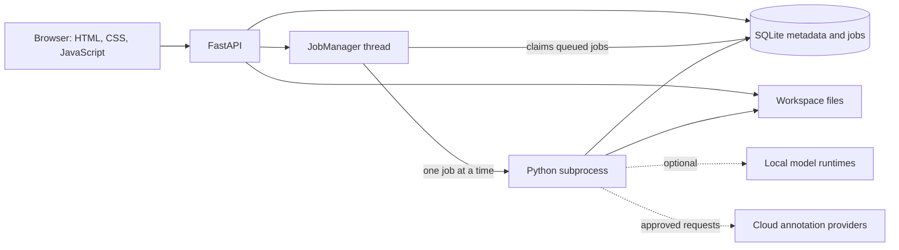

# Architecture

[Documentation](README.md)

IRIS is a local, single-user application for building and comparing object
detectors from images and videos. It also supports temporal annotations, saved
detector outputs and tracker comparisons. The application does not depend on
Argos, a drone connection or a cloud account.

## System overview

One Python process serves the browser interface and JSON API. A supervisor thread
claims jobs from SQLite and starts a fresh subprocess for each job, one at a time.
Metadata lives in SQLite; source media, datasets, model weights and reports live
in the same workspace directory.

FastAPI serves the static interface from the same origin; there is no frontend
build step or separate database server. Manual annotation, data management and
saved-result inspection work without the optional ML packages or a GPU.
Model downloads and external requests are explicit operations.

The CLI binds the server to `127.0.0.1`. Host and origin checks restrict browser
requests, but IRIS does not implement user accounts or public-service
authentication. An SSH tunnel can expose a workstation's local interface while
keeping its computation and files on that workstation.

## Code map

Paths below are relative to `src/iris/`. Feature modules implement the processing;
API routes and the browser interface call those services.

| Area | Main entry points |
| --- | --- |
| Server and interface | [`cli.py`](../src/iris/cli.py), [`app.py`](../src/iris/app.py), [`static/`](../src/iris/static/) |
| Storage and project scope | [`store.py`](../src/iris/store.py), [`projects.py`](../src/iris/projects.py), [`taxonomies.py`](../src/iris/taxonomies.py) |
| Import and selection | [`media.py`](../src/iris/media.py), [`coco_import.py`](../src/iris/coco_import.py), [`selection.py`](../src/iris/selection.py) |
| Annotation and suggestions | [`annotations.py`](../src/iris/annotations.py), [`preannotation.py`](../src/iris/preannotation.py), [`assistance.py`](../src/iris/assistance.py) |
| Dataset releases | [`datasets.py`](../src/iris/datasets.py), [`dataset_planning.py`](../src/iris/dataset_planning.py), [`dataset_export.py`](../src/iris/dataset_export.py) |
| Model execution | [`models.py`](../src/iris/models.py), [`training.py`](../src/iris/training.py), [`inference.py`](../src/iris/inference.py), [`evaluation.py`](../src/iris/evaluation.py) |
| Job lifecycle | [`jobs.py`](../src/iris/jobs.py), [`worker.py`](../src/iris/worker.py), [`job_recovery.py`](../src/iris/job_recovery.py) |
| Temporal data and tracking | [`temporal_detections.py`](../src/iris/temporal_detections.py), [`temporal_identities.py`](../src/iris/temporal_identities.py), [`tracking_comparisons.py`](../src/iris/tracking_comparisons.py), [`tracking_quality.py`](../src/iris/tracking_quality.py) |
| Portable artifacts | [`model_exports.py`](../src/iris/model_exports.py), [`pipeline_bundles.py`](../src/iris/pipeline_bundles.py), [`pipeline_runtime.py`](../src/iris/pipeline_runtime.py) |
| Backup and restoration | [`workspace_operations.py`](../src/iris/workspace_operations.py), [`workspace_archive.py`](../src/iris/workspace_archive.py), [`workspace_restore.py`](../src/iris/workspace_restore.py) |

## From source data to a model

### Import and review

A session owns imported images or videos and their frames. Selection records
which frames to work on; it does not imply that their labels have been reviewed.
COCO import retains source metadata and explicit class mappings. Class versions
are immutable, and consumers use their saved mappings rather than assuming that
numeric category IDs mean the same thing in every model or dataset.

Annotations are saved as complete revisions. Saving checks the revision the
editor opened, so an older tab cannot overwrite a newer save. Model suggestions
remain separate from human annotations and require an accept, correct or reject
decision. Validation covers the whole image, including missing objects and
images with no objects. A prediction or completed provider request never counts
as human validation.

See [intake and selection](intake-selection.md), [class versions](classes.md),
[COCO import](coco-import.md) and [the annotation editor](annotation-editor.md).

### Freeze a dataset

A release copies its images, specific validated annotation revisions, class
definitions and provenance into a frozen dataset. Publication checks the revisions
shown in the builder, stages the files, then publishes the completed release.
Later annotation edits do not change that release's training inputs.

Train, validation and test assignments apply to whole scene groups. Exact pixel
hashes and original video hashes retain their split across the workspace;
scene-group reservations apply within a project. These checks catch known reuse,
but cannot prove that different recordings or similar images are independent.
Related scenes still need appropriate grouping by the user.

The manifest records hashes and label mappings and is checked when consumed.
COCO export reads this frozen release, not the current editor state. See
[dataset publication and export](dataset-export.md).

### Train and compare

The model catalogue declares available architectures without loading a model or
contacting a service. Current detector families are SSDLite, Faster R-CNN and
YOLOX-Nano; training scopes and supported class heads are declared separately.
Torch and other optional runtimes load when a model operation needs them.

A training run records its dataset, parent checkpoint, scope and configuration
before entering the queue, then verifies those inputs in the worker. Training
reads the train split. Failed or cancelled runs keep their logs and recovery
artifacts without registering a finished inference model. Recovery checkpoints
also contain optimizer and random state; they are distinct from model exports.

Visual comparisons help inspect predictions on individual frames. Evaluation
measures a complete frozen validation or test split against reviewed annotations.
It records the checkpoint and inference recipe, including full-image or tiled
processing. AP and metrics at a selected confidence threshold answer different
questions; changing the display threshold does not retrain a model.

See [model comparison](model-comparison.md), [trainable models](trainable-models.md), [training recovery](long-training.md),
[evaluation](evaluation.md) and [saved experiments](experiments.md).

### Export

A model export packages weights, classes, preprocessing and a standalone runner.
Native Torchvision exports preserve checkpoint bytes; the separate YOLOX ONNX
profile converts the graph and checks it against saved reference outputs.
Pipeline bundles package a detector with a native tracker and, optionally, an
explicit selected-object policy. They can execute outside IRIS without Argos.

Packaging, prediction parity, model quality and speed on target hardware are
separate checks. An export is not evidence of field performance or an automatic
deployment. See [model export](model-export.md), [YOLOX ONNX](yolox-onnx.md),
[pipeline bundles](pipeline-bundles.md) and [runtime qualification](pipeline-qualification.md).

## Temporal data and tracking

Temporal sequences retain ordered frames and their source indices and timestamps.
A detector cache stores the outputs of a fixed detector recipe so trackers can be
compared on the same detections without rerunning the detector. Native ByteTrack
and BoT-SORT adapters run per sequence; learned ReID is not part of these adapters.

Human reference identities are separate from tracker IDs. Tracker predictions
also remain distinct from measured observations. Quality reports use explicit
review coverage; unreviewed intervals do not become verified negatives. Tracker
memory advances by processed updates, while source gaps and timing remain visible.

Tracking quality, execution cost and selected-object behavior have separate
reports. See [temporal data](temporal-data.md), [detector caches](temporal-detections.md),
[tracking adapters](tracking.md), [tracking quality](tracking-quality.md) and
[selected-object studies](selected-object.md).

## Jobs and recovery

The normal server takes an exclusive workspace lock. Its `JobManager` thread
claims one queued job and launches `python -m iris.worker` with the workspace,
job ID and parent process ID. The worker writes progress and results to SQLite
and a per-job log file. Linux process handling ties its lifetime to the server;
cancellation first requests shutdown, then terminates a worker that does not stop.

Jobs retain their configuration and finish as succeeded, failed, cancelled or
interrupted. Updates check that the attempt is still running, preventing late
results from overwriting a stopped attempt. On startup, queued and running jobs
from the previous server are marked interrupted; they are not automatically
restarted.

Recovery depends on the operation. Extraction and temporal detection can retain
verified completed frames; training can resume from compatible recovery state.
A continuation creates a linked attempt and rechecks its inputs. Complete-pair
tracking comparisons publish their report only after both replays finish. See
[job recovery](job-recovery.md) for the supported paths and their limits.

## Workspace and compatibility

The default workspace is `.iris`, configurable through `--data-dir` or
`IRIS_DATA_DIR`. `iris.sqlite3` stores records and artifact references; files hold
media, frozen datasets, weights, logs and reports. SQLite uses WAL mode and
foreign-key checks. The current database schema is **22**, with migrations applied
when a workspace is opened. Database schema numbers and dataset manifest formats
are independent.

Projects scope sessions, datasets, trained checkpoints and experiments. Official
weights, provider availability and the job queue are shared across the workspace.
Projects organize one user's work; they are not separate security boundaries.
See [projects](projects.md).

Backup uses a separate background transfer manager. An admission gate blocks new
HTTP mutations while an idle workspace is copied into a streamed archive with a
consistent SQLite snapshot. Restoration verifies the archive and creates a new
workspace directory; it does not overwrite the active workspace or run models.
Archives from schemas 12–22 are supported. Restored databases migrate only when
opened normally. See [backup and recovery](workspace-backup.md).

## Optional annotation providers

Detector preannotation proposes boxes for review. Local or hosted Qwen candidate
review checks existing boxes and categories; it does not generate new coordinates.
DINO-X and the separate benchmark adapters have their own proposal capabilities.
Their outputs pass through explicit coordinate and class contracts before review.
Full segmentation workflows remain outside the application.

Cloud requests require configured credentials and an explicit preview and launch.
The preview fixes the selected images, settings and cost allowance. Request
receipts distinguish confirmed responses from uncertain submissions; uncertain
paid requests are not automatically retried. Keys remain on the server side.
The local workflow remains usable without these providers.

See [preannotation](preannotation.md), [multimodal review](multimodal-review.md), [annotation batches](annotation-batches.md),
[DINO-X](dinox-preannotation.md) and [independent annotation benchmarks](benchmark.md).
The [acceptance results](acceptance-results.md) distinguish software checks from
executed model runs and record the limits of the evidence collected so far.
